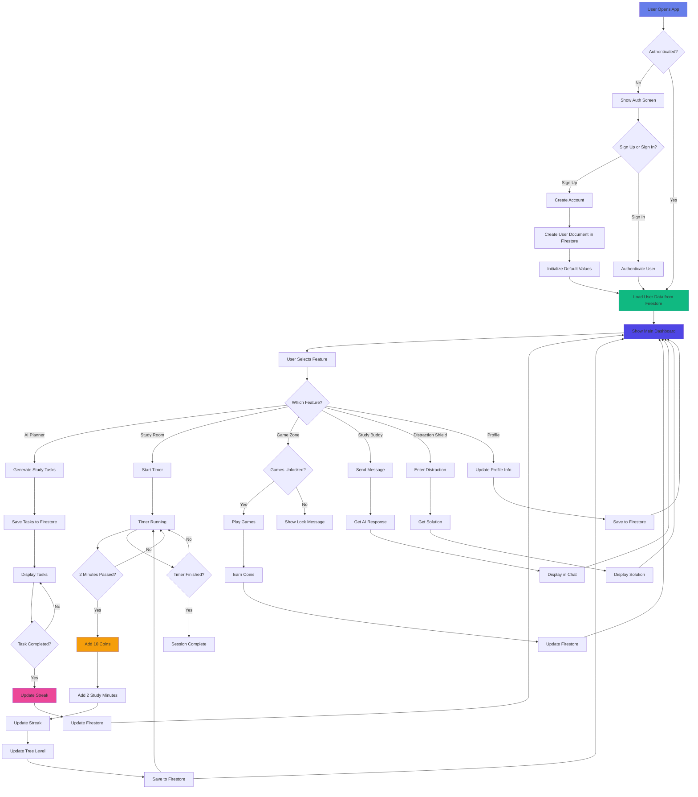

# 🌱 ZenStudy - Student Growth Companion App

A comprehensive web application designed for students aged 16-22 to help them plan their studies, track progress, build discipline through streaks, and visualize their growth journey. The app gamifies learning by turning study sessions into a virtual tree that grows from a seed to a full-grown tree as students complete tasks and study consistently.

  

---

## 📋 Table of Contents

- [Features](#-features)
- [Tech Stack](#-tech-stack)
- [Project Structure](#-project-structure)
- [Getting Started](#-getting-started)
- [How to Use](#-how-to-use)
- [Application Flow](#-application-flow)
- [Firebase Setup](#-firebase-setup)
- [Features Breakdown](#-features-breakdown)
- [Troubleshooting](#-troubleshooting)

---

## ✨ Features

### Core Features
- 🔐 **User Authentication** - Secure email/password authentication with Firebase
- 📅 **AI Schedule Planner** - Automatically generate study schedules based on subjects
- ✅ **Task Management** - Create, track, and complete study tasks
- ⏱️ **Study Timer** - Pomodoro-style focus sessions (25 minutes)
- 🎮 **Gamification** - Earn coins and unlock games by studying
- 🌳 **Growth Visualization** - Watch your virtual tree grow from seed 🌱 to tree 🌳
- 🔥 **Streak Tracking** - Build daily study habits with streak counters
- 🤖 **AI Study Buddy** - Interactive chatbot for study assistance
- 🛡️ **Distraction Solver** - Get personalized solutions for common distractions
- 👤 **Profile Management** - Customize your profile and track stats

### Visual Features
- Modern, user-friendly light theme with gradient backgrounds
- Smooth animations and transitions
- Responsive design
- Interactive dashboard with real-time stats

---

## 🛠 Tech Stack

- **Frontend**: HTML5, CSS3, JavaScript (Vanilla)
- **Backend**: Firebase (Authentication & Firestore)
- **Styling**: Custom CSS with CSS Variables
- **Icons**: Font Awesome 6.0
- **Fonts**: Google Fonts (Inter)

---

## 📁 Project Structure

```
AIPlanner/
├── index.html          # Main HTML structure
├── styles.css          # All CSS styles
├── app.js              # Application logic and Firebase integration
├── README.md           # This file
└── FIREBASE_SETUP.md   # Detailed Firebase setup guide
```

---

## 🚀 Getting Started

### Prerequisites
- A modern web browser (Chrome, Firefox, Safari, Edge)
- A Firebase account (free tier available)
- A local web server (optional, for development)

### Installation

1. **Clone or download the repository**
   ```bash
   git clone <repository-url>
   cd AIPlanner
   ```

2. **Set up Firebase**
   - Follow the instructions in [FIREBASE_SETUP.md](./FIREBASE_SETUP.md)
   - Update Firebase configuration in `app.js` (lines 3-11)

3. **Open the application**
   - Option 1: Open `index.html` directly in your browser
   - Option 2: Use a local server:
     ```bash
     # Using Python
     python -m http.server 8000
     
     # Using Node.js (http-server)
     npx http-server
     
     # Using PHP
     php -S localhost:8000
     ```
   - Navigate to `http://localhost:8000` in your browser

---

## 📖 How to Use

### Step 1: Create an Account
1. Open the application in your browser
2. Click **"New here? Create account"**
3. Enter your email address and password
4. Click **"Create Account"**
5. Your account will be created and you'll be automatically logged in

### Step 2: Explore the Dashboard
- View your current **Study Time**, **Tree Level**, **Tasks Done**, and **Streak**
- Watch your virtual tree grow as you study more
- The tree evolves: 🌱 Seed → 🌿 Plant → 🌲 Tree → 🌳 Mature Tree

### Step 3: Create Your Study Plan
1. Navigate to **"AI Planner"** from the sidebar
2. Enter subjects you need to study (e.g., "Math, Physics, Chemistry")
3. Click **"Generate AI Plan"**
4. The app will create a list of tasks for you
5. Check off tasks as you complete them

### Step 4: Start a Study Session
1. Go to **"Study Room"**
2. Choose **"Single Study"** or **"Group Study"**
3. Click **"Start Focus Session"** to begin a 25-minute timer
4. Earn **10 coins every 2 minutes** of focused study
5. Your study time and streak will update automatically

### Step 5: Track Your Progress
- Check your **Dashboard** regularly to see:
  - Total study minutes
  - Current streak (consecutive days)
  - Tree growth level
  - Coins earned

### Step 6: Unlock Games
- Study for at least **2 minutes** to unlock games
- Go to **"Game Zone"** to play and earn more coins
- Games are locked until you meet the study requirement

### Step 7: Use Additional Features
- **Study Buddy AI**: Ask questions about your studies
- **Distraction Shield**: Get solutions for common distractions
- **Profile**: Update your name, email, and view your avatar

### Step 8: Maintain Your Streak
- Study or complete tasks **every day** to maintain your streak
- Missing a day will reset your streak to 1
- The longer your streak, the more motivated you'll stay!

---

## 🔄 Application Flow



### Flow Description

1. **Authentication Flow**: User must sign up or sign in to access the app
2. **Data Loading**: User data is loaded from Firestore on login
3. **Feature Selection**: User can navigate between different features
4. **Task Management**: Tasks are created, tracked, and completed
5. **Study Timer**: Timer tracks study time and rewards coins
6. **Streak System**: Automatically tracks consecutive study days
7. **Tree Growth**: Tree level updates based on total study minutes
8. **Data Persistence**: All changes are saved to Firestore in real-time

---

## 🔥 Firebase Setup

### Quick Setup Steps

1. **Create Firebase Project**
   - Go to [Firebase Console](https://console.firebase.google.com/)
   - Create a new project

2. **Enable Authentication**
   - Go to Authentication → Sign-in method
   - Enable Email/Password

3. **Create Firestore Database**
   - Go to Firestore Database
   - Create database in test mode
   - Set up security rules (see FIREBASE_SETUP.md)

4. **Get Configuration**
   - Go to Project Settings
   - Add a web app
   - Copy the config object

5. **Update app.js**
   - Replace the `firebaseConfig` object in `app.js` with your config

For detailed instructions, see [FIREBASE_SETUP.md](./FIREBASE_SETUP.md)

---

## 🎯 Features Breakdown

### 1. Authentication System
- Email/password authentication
- Secure user sessions
- Automatic login persistence
- Sign up and sign in modes

### 2. AI Schedule Planner
- Input subjects or topics
- Automatically generates study tasks
- Task checklist with completion tracking
- Tasks saved to Firestore

### 3. Study Timer (Pomodoro)
- 25-minute focus sessions
- Pause/Resume functionality
- Automatic coin rewards (10 coins per 2 minutes)
- Study time accumulation
- Streak updates on completion

### 4. Growth Visualization
- **Tree Levels**:
  - 🌱 Seed (0-10 minutes)
  - 🌿 Plant (10-30 minutes)
  - 🌲 Tree (30-60 minutes)
  - 🌳 Mature Tree (60+ minutes)
- Visual feedback on progress

### 5. Streak System
- Tracks consecutive study days
- Updates automatically when:
  - Study timer completes
  - Tasks are completed
- Resets if a day is missed

### 6. Gamification
- **Coins**: Earned through study sessions and games
- **Games**: Unlocked after 2 minutes of study
- **Rewards**: Visual feedback for achievements

### 7. AI Study Buddy
- Interactive chatbot interface
- Study-related responses
- Encouragement and tips

### 8. Distraction Solver
- Input common distractions
- Get personalized solutions
- Tips for phone, noise, tiredness, etc.

### 9. Profile Management
- Update display name
- Update email
- Auto-generated avatar
- View statistics

---

## 🐛 Troubleshooting

### Common Issues

**1. Firebase Authentication Errors**
- **Problem**: "auth/email-already-in-use" or similar
- **Solution**: Check if email is already registered, or use sign in instead

**2. Firestore Permission Denied**
- **Problem**: "Missing or insufficient permissions"
- **Solution**: Check Firestore security rules (see FIREBASE_SETUP.md)

**3. Data Not Saving**
- **Problem**: Changes not persisting
- **Solution**: 
  - Check browser console for errors
  - Verify Firebase config is correct
  - Ensure user is authenticated

**4. Timer Not Working**
- **Problem**: Timer doesn't start or countdown
- **Solution**: 
  - Check browser console for JavaScript errors
  - Ensure app.js is loaded correctly
  - Refresh the page

**5. Styles Not Loading**
- **Problem**: Page looks unstyled
- **Solution**: 
  - Verify styles.css is in the same directory
  - Check the link tag in index.html
  - Clear browser cache

### Browser Compatibility
- ✅ Chrome/Edge (latest)
- ✅ Firefox (latest)
- ✅ Safari (latest)
- ⚠️ Internet Explorer (not supported)

---

## 📊 Data Structure

### Firestore Collection: `users`

Each user document contains:
```javascript
{
  email: string,
  displayName: string,
  coins: number,
  studyMinutes: number,
  treeLevel: number (1-3),
  tasks: Array<{
    id: number,
    text: string,
    done: boolean
  }>,
  gamesUnlocked: boolean,
  streak: number,
  lastStudyDate: Timestamp,
  profilePic: string,
  createdAt: Timestamp,
  lastUpdated: Timestamp
}
```

---

## 🎨 Design Philosophy

- **User-Friendly**: Light theme with soft colors for reduced eye strain
- **Motivational**: Gamification elements to encourage consistent study
- **Visual Feedback**: Tree growth provides tangible progress visualization
- **Simple Navigation**: Clean sidebar navigation with clear icons
- **Responsive**: Works well on different screen sizes

---

## 🔐 Security

- User data is isolated per user (Firestore security rules)
- Passwords are handled securely by Firebase Auth
- No sensitive data stored in localStorage
- All data encrypted in transit

---

## 📝 License

This project is open source and available under the MIT License.

---

## 🤝 Contributing

Contributions are welcome! Please feel free to submit a Pull Request.

---

## 📧 Support

For issues, questions, or suggestions, please open an issue in the repository.

---

## 🎓 Future Enhancements

- [ ] Real AI integration for study planning
- [ ] Social features (study groups, leaderboards)
- [ ] Mobile app version
- [ ] More game options
- [ ] Study analytics and insights
- [ ] Export study reports
- [ ] Calendar integration
- [ ] Reminder notifications

---

**Made with ❤️ for students who want to grow their minds**

*Happy Studying! 🌱→🌳*

